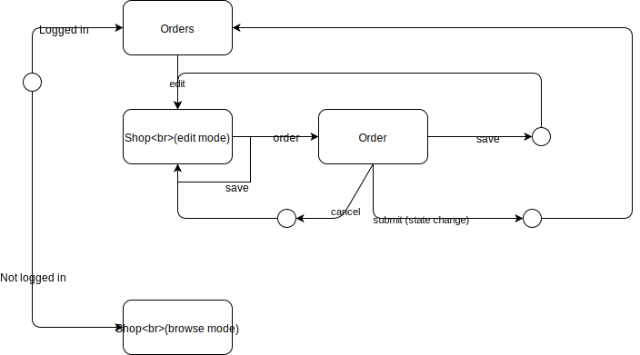
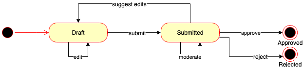

# molgenis-app-lifelines-webshop


## Project setup
```
cp .lifelinesrc.example .lifelinesrc
yarn install
```

### Compiles and hot-reloads for development
```
yarn run serve
```

### Production usage
You need to configure a couple of things to run this app in production.


- **vue.config.js**
  Add a public path to specify the path on which the app is served.
  ```
  const packageJson = require('./package.json')

  ...
  module.export
    ...
    publicPath: process.env.NODE_ENV === 'production'
      ? packageJson.name + '/dist/'
      : '/',
  ```
- **package.json**
  Add a scope for the package name to publish to a organisation scope on NPM.
  ```
  "name": "*scope*/molgenis-app-lifelines-webshop",
  ```
  Add the publish config with scope public, otherwise you cannot publish to NPM.
  ```
  "publishConfig": {
    "access": "public"
  },
  ```
  Add a target for webservers to resolve to.
  ```
  "main": "dist/index.html",
  ```
  Add directories to pick up when building for production.
  ```
  "files": [
    "dist",
    "src"
  ],
  ```

- **route.ts**
  Change the default base when you want to serve your app on a path other than ```/```
  ```
  export default new Router({

  ...

  base: process.env.NODE_ENV === 'production' ? packageJson.name : process.env.BASE_URL,
  ```
 - **i18n**
  For development and testing you can add your translations to `i18n.schemas.js`
  For production make sure to add the translations to the molgenis entity `Localization` using `lifelines-webshop` as a namespace.

  >tip:
  Use `i18n.schemas.js` to create the `Localization` entities. For `msgid` add the schema key (for example: "lifelines-webshop-sidebar-header")
  The namespace should be `lifelines-webshop` and than add all of the needed translations.

#### Compile and minify
```
yarn run build
```

### Run your tests
```
yarn run test
```

### Lints and fixes files
```
yarn run lint
```

### Run your end-to-end tests
```
yarn run test:e2e
```

### Run your unit tests
```
yarn run test:unit
```

## Data
To transform the raw data to a format that can be used by this app, use the 
[molgenis-py-lifelines-transform](https://github.com/molgenis/molgenis-py-lifelines-transform) tool.

## Deployment using molgenis commander
Add the `deployment/datasets` folder of this repository to the `dataset_folders` section of `~/.mcmd/mcmc.yaml` and the 
`deployment/resources` folder to the `resource_folders` section, or alternatively copy the files in 
`deployment/datasets` to one of your configured `dataset_folders` and the contents of `deployment/resources` to one of 
your configured `resource_folders`.  
Now configure your molgenis commander to run on the lifelines server using `mcmd config add host` and 
`mcmd config set host`. Then you can run the commander script to setup the server:
```
cp ~/molgenis-app-lifelines-webshop/deployment/lifelines ~/.mcmd/scripts/
mcmd run lifelines -i
```

## Workflow

### Workflow of the catalogue


### Order process


